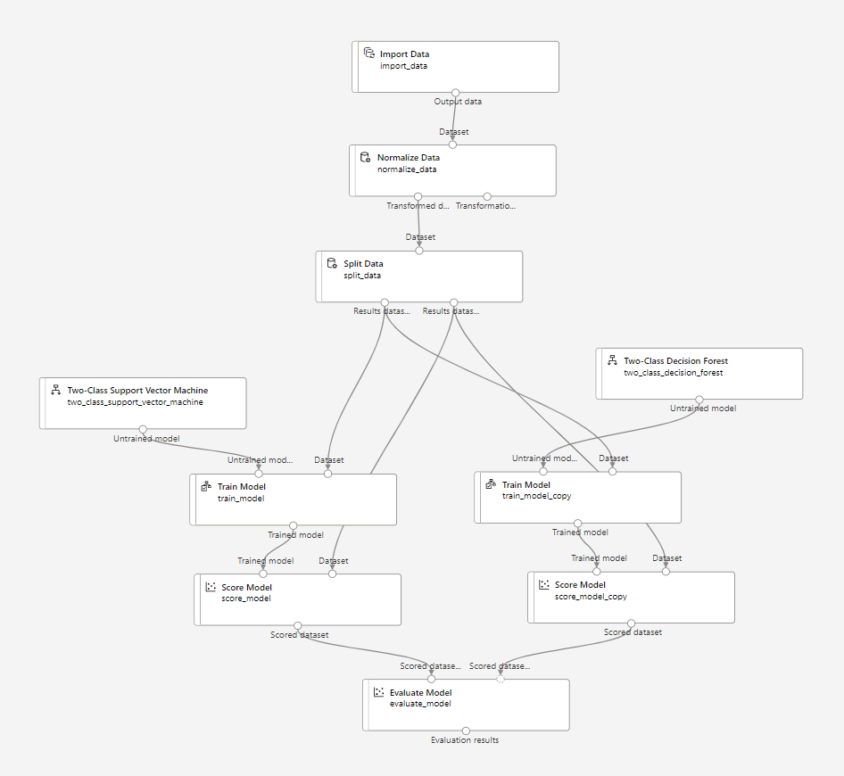
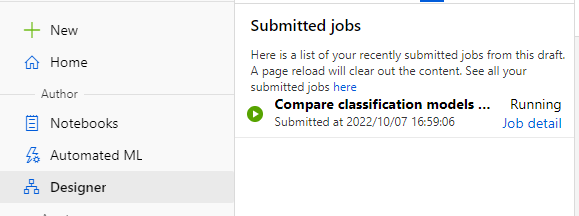

---
lab:
    title: 'Train a model with the Azure Machine Learning Designer'
---

# Train a model with the Azure Machine Learning Designer

Azure Machine Learning Designer provides a drag and drop interface with which you can define a workflow. You can create a workflow to train a model, testing and comparing multiple algorithms with ease.

In this exercise, you'll use the Designer to quickly train and compare two classification algorithms.

## Before you start

You'll need an [Azure subscription](https://azure.microsoft.com/free) in which you have administrative-level access.

## Provision an Azure Machine Learning workspace

An Azure Machine Learning *workspace* provides a central place for managing all resources and assets you need to train and manage your models. You can interact with the Azure Machine Learning workspace through the Studio, Python SDK, and Azure CLI. 

You'll use a Shell script which uses the Azure CLI to provision the workspace and necessary resources. Next, you'll use the Designer in the Azure Machine Learning Studio to train and compare models.

### Create the workspace and compute cluster

To create the Azure Machine Learning workspace and a compute cluster, you'll use the Azure CLI. All necessary commands are grouped in a Shell script for you to execute.
1. In a browser, open the Azure portal at [http://portal.azure.com](https://portal.azure.com/?azure-portal=true), signing in with your Microsoft account.
1. Select the [>_] (*Cloud Shell*) button at the top of the page to the right of the search box. This opens a Cloud Shell pane at the bottom of the portal.
1. The first time you open the cloud shell, you will be asked to choose the type of shell you want to use (*Bash* or *PowerShell*). Select **Bash**.
1. If you are asked to create storage for your cloud shell, check that the correct subscription is specified and select **Create storage**. Wait for the storage to be created.
1. In the terminal, enter the following commands to clone this repo:
    ```bash
    rm -r azure-ml-labs -f
    git clone https://github.com/MicrosoftLearning/mslearn-azure-ml.git azure-ml-labs
    ```
1. After the repo has been cloned, enter the following commands to change to the folder for this lab and run the `setup.sh` script it contains:
    ```bash
    cd azure-ml-labs/Labs/04
    ./setup.sh
    ```
1. Wait for the script to complete - this typically takes around 5-10 minutes. 

## Create a new pipeline

When you've created the workspace and necessary compute cluster, you can open the Azure Machine Learning Studio and create a training pipeline with the Designer. 

1. In the Azure portal, navigate to the Azure Machine Learning workspace named `mlw-dp100-labs`.
1. Select the Azure Machine Learning workspace, and in its **Overview** page, select **Launch studio**. Another tab will open in your browser to open the Azure Machine Learning Studio.
1. Within the Azure Machine Learning Studio, navigate to the **Compute** page and verify that the compute cluster you created in the previous section exist. The cluster should be idle and have 0 nodes running.
1. Navigate to the **Designer** page and create a new empty pipeline.
1. Change the default pipeline name (**Pipeline-Created-on-*date***) to **Visual Diabetes Training** by clicking the **&#9881;** icon at the right to open the **Settings** pane.
1. You'll need to specify a compute target on which to run the pipeline. In the **Settings** pane, under **Select compute type** and select **Compute cluster**, and under **Select Azure ML compute cluster** and select `aml-cluster`. Close the settings pane.

## Import the data
To train a model, you'll need data. You can use any data stored in a datastore or use a publicly accessible URL.

1. On the left side of the Designer, select the **Component** tab.
1. Select the filter icon next to the search bar and filter by **Designer built-in assets only**.
1. Expand the **Data Input and Output** section and drag and drop the **Import Data** component onto the canvas to add the component to the pipeline.
1. On the right side of the Designer, open the parameters pane. 
1. Set the following parameters for the **Import Data** component:
    - **Data source**: URL via HTTP
    - **Data source URL**: `https://aka.ms/diabetes-data`
1. Select **Preview schema** to verify the data source works as expected. There should be 10 column names, with one column named **Diabetic**.
1. Add the component **Normalize data** to the pipeline, below the **Import Data** component. You can search for the component with the search bar on the left side of the pipeline.
1. Connect the output from the **Import Data** component to the input of the **Normalize Data** component.
1. Configure the parameters of the **Normalize Data** component:
    - **Transformation method**: ZScore
    - **Columns to transform**: `PlasmaGlucose, DiastolicBloodPressure, TricepsThickness, SerumInsulin, BMI, DiabetesPedigree` *Copy and paste the comma-separated list of column names*
1. To separate the data into a training and validation dataset, you'll split the data. Search for the **Split Data** component and drag it onto the canvas, below the **Normalize Data** component.
1. Connect the *Transformed Dataset* (left) output of the **Normalize Data** component to the input of the **Split Data** component.
1. Select the **Split Data** component, and configure its settings as follows:
    * **Splitting mode**: Split Rows
    * **Fraction of rows in the first output dataset**: 0.75
    * **Random seed**: 123
    * **Stratified split**: False

## Add model training components

With the data prepared and split into training and validation datasets, you're ready to configure the pipeline to train and compare models.

1. Search for the **Train Model** component and drag it onto the canvas, under the **Split Data** component. 
1. Connect the *Result dataset1* (left) output of the **Split Data** component to the *Dataset* (right) input of the **Train Model** component.
1. The model you'll train will predict the **Diabetic** value, so select the **Train Model** component and modify its settings to set the **Label column** to  **Diabetic** (matching the case and spelling exactly!)

The **Diabetic** label the model will predict is a binary column (1 for patients who have diabetes, 0 for patients who don't), so you'll need to train the model using a *classification* algorithm.

4. Search for the **Two-Class Support Vector Machine** component and drag and drop it onto the canvas, to the left of the **Split Data** component and above the **Train Model** component. 
1. Connect the **Two-Class Support Vector Machine** output to the *Untrained model* (left) input of the **Train Model** component.
1. To test the trained model, you need to use it to score the validation dataset you held back when you split the original data. Search for the **Score Model** component and drag and drop it onto the canvas, below the **Train Model** component.
1. Connect the output of the **Train Model** component to the **Trained model** (left) input of the **Score Model** component; and drag the *Results dataset2* (right) output of the **Split Data** component to the *Dataset* (right) input of the **Score Model** component.
1. To evaluate how well the model performs, you need to look at some metrics generated by scoring the validation dataset. Search for the **Evaluate Model** component and drag it to the canvas, under the **Score Model** component, and connect the output of the **Score Model** component to the **Score dataset** (left) input of the **Evaluate Model** component.

## Train a second model to compare

To train a classification model with the Designer, there are various algorithms to choose from. To compare between algorithms and evaluate which performs better, you can train two models within one pipeline and compare.

1. Still within the same pipeline you've been working in so far, add the following components to train a second model and to compare the two models:
    - **Train model**. The parameter **Label column** set to `Diabetic`.
    - **Two-Class Decision Forest** connected to **Train model**.
    - **Score Model** connected to **Train model** and the right input of **Evaluate model**.
1. Verify that your pipeline looks similar to the example:



3. At the top, select **Submit**. 
1. When prompted, create a new experiment named **designer-compare-classification**, and run it.  

Submitting the job will initialize the compute cluster. As the compute cluster was idle up until now, it may take some time for the cluster to resize to more than 0 nodes. Once the cluster has resized, it will automatically start running the pipeline. 

5. You can view the status of the pipeline run by selecting **Job detail** in the **Submitted jobs** pane on the left.



You'll be able to track the run of each component. When the pipeline fails, you'll be able to explore which component failed and why it failed. Error messages will show in the **Outputs + logs** tab of the job overview.

## Evaluate models in the Designer

When the pipeline is completed, you can explore the pipeline job overview, and its child jobs. Each child job represents a component run. 

To explore the output of the pipeline:
1. Navigate to the completed pipeline job. All components should have a green icon, which represents successful completion.
1. Right-click the output port of the **Evaluate Model** component.
1. Select **Preview data**.
1. Explore the **Evaluation_results** pane on the right-side.

The graphs represent the evaluation metrics of both models. The confusion matrix and tables below the graphs will show the evaluation metrics of the model selected at the top: you can switch between views by selecting **Left port** (Support Vector Machine) or **Right port** (Decision Forest).

5. Try and determine which model performed better.

## Delete Azure resources

When you finish exploring Azure Machine Learning, you should delete the resources you've created to avoid unnecessary Azure costs.

1. Close the Azure Machine Learning Studio tab and return to the Azure portal.
1. In the Azure portal, on the **Home** page, select **Resource groups**.
1. Select the **rg-dp100-labs** resource group.
1. At the top of the **Overview** page for your resource group, select **Delete resource group**. 
1. Enter the resource group name to confirm you want to delete it, and select **Delete**.